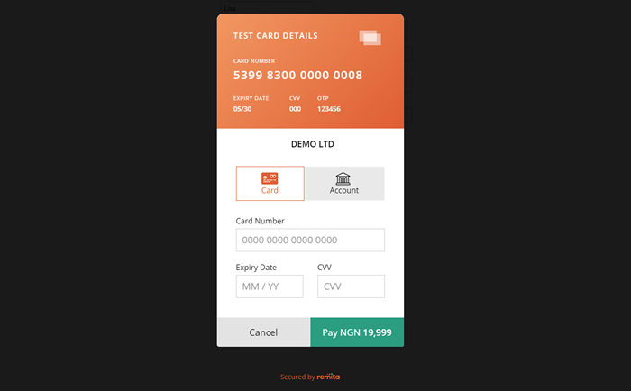

# Remita OpenCart 3.x Payment Gateway

---
- [Summary](#summary)
- [Features](#Features)
- [Install](#Install)
- [Setup](#setup)

---
### Summary

With Remita OpenCart Payment Plugin, the store admin can easily add all desired payment methods to the OpenCart webshop. Please refer to https://www.remita.net for an overview of all features and services.

 

---

### Plugin Features

*   __Accept payment__ via Visa Cards, Mastercards, Verve Cards and eWallets

* 	__Seamless integration__ into the OpenCart checkout page.
* 	__Add Naira__ currency symbol. To select it, On OpenCart Admin, click on __System > Localisation > Currencies__ from the left hand menu.

---

### Install

1. Download the Remita plugin zip file

2. Extract the downloaded file and Copy the extracted folders(admin and catalog) to "upload folder" in your OpenCart folder
3. Login to your OpenCart Admin(On your browser). Click on "Extensions > Extensions" from the left hand menu
4. On Choose the extension type drop down, click on "Payments"
5. Scroll to "Remita" and click install ( the "+" sign changes to "-" )

### Setup

1. Login to your OpenCart Admin(On your browser). Click on "Extensions > Payments" from the left hand menu

2. Scroll to "Remita" and click Edit( button beside installation button"+" )
3. Enter the public key and secrete key (these can be found in the Remita Gateway Admin Panel --> https://login.remita.net/remita/registration/signup.spa
4. Set the "Status" drop down to "Enabled" ( It is disabled on default )
5. Save the settings
6. A success message is displayed on the screen to show your plugin has been installed and the setup was successful.

## Useful links
* Join our Slack Developer/Support channel at http://bit.ly/RemitaDevSlack
    
## Support
- For all other support needs, support@remita.net
- To contribute to this repo, create an issue on what you intend to fix or update, make a PR and team will look into it and merge.
